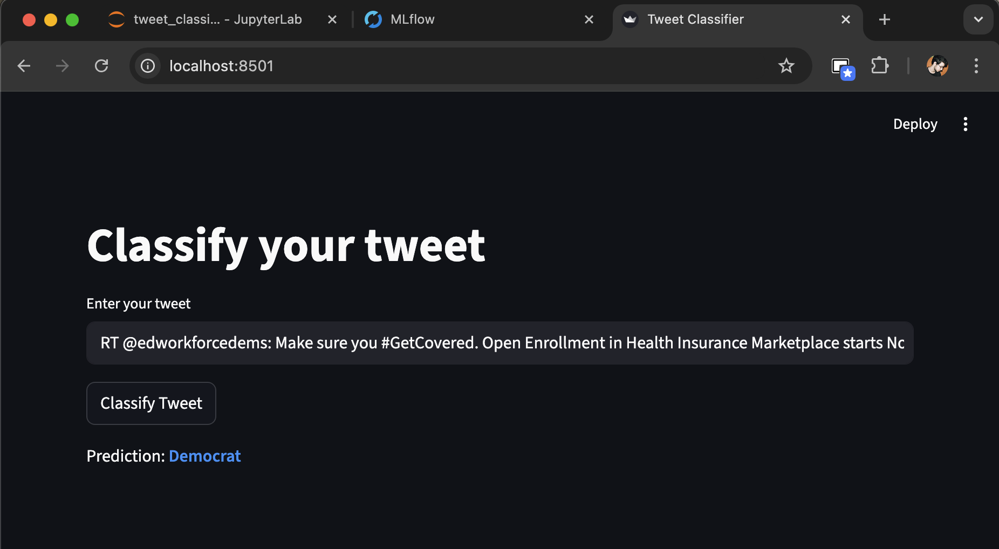

# Tweet Prediction

The election is coming! We want to build an application that can parse a Tweet and determine which political party to associate with the Tweet, Republican or Democrat. 

## Project Overview

This project uses machine learning to classify Tweets into one of two political parties:
- **Democrat** (displayed in blue)
- **Republican** (displayed in red)

The application is built using:
- **Python** for data processing and model training.
- **MLflow** for model tracking and artifact storage.
- **FastAPI** for serving the model as an inference endpoint.
- **Streamlit** for the user interface.

---

## Project Setup

### Pre-requisites

Please make sure you have the following software installed

- Python (3.10 or 3.11)
- Docker and Docker Compose (for containerized deployment)


### Install all python dependencies

Before you install dependencies make sure you add your python path to the makefile.

```bash
make install
```

### Running the Application

The application consists of two main components:

1. Model Inference Endpoint (FastAPI)
2. User Interface (Streamlit)

#### Using docker compose 

1. build and start the services:

```bash
make run
```

2. Access the application:
- Streamlit UI: http://localhost:8501
- FastAPI Endpoint: http://localhost:8000



### Testing
Run the unit tests using the following command:

```bash
make test
```

### Train the inference model
Run the following command to train a XGBoost classifier with data from the `data/Tweets.csv` file:

```bash
make train
```

This will create three runs withing mlflow, one for the `encoders`, another for the `vectorizer` and the last one for the `model` itself. Make sure to update the `MODEL_PATH`, `ENCODER_PATH` and `VECTORIZER_PATH` constants from `src/text_loader/loader.py` with the file paths generated by mlflow. Run the following command to access the mlflow ui and look for the artifact paths:

```bash
mlflow ui
```
